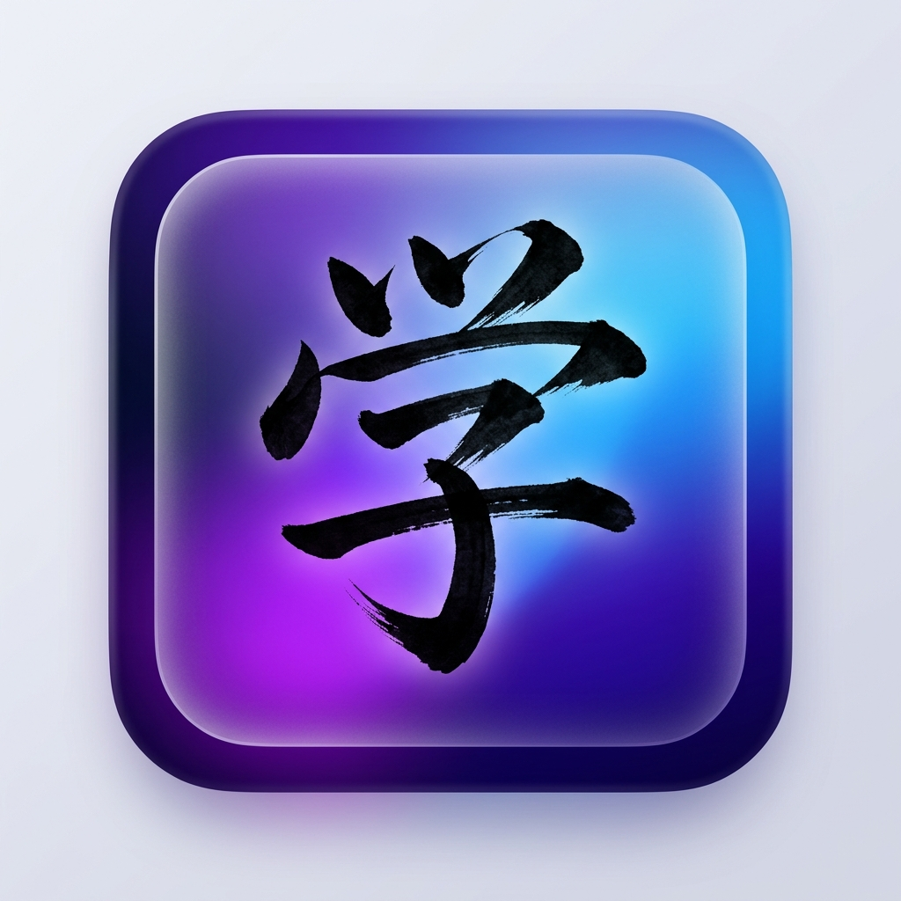

<div align="center">
  
  
  # Fun Kanji

  **The Ultimate All-in-One Japanese Writing System Companion**

  [](https://github.com/Cancelllls/fun-with-kanji/actions)
  [](https://github.com/Cancelllls/fun-with-kanji/actions)
  [](https://opensource.org/licenses/MPL-2.0)
</div>

<br>

**Fun Kanji** is a premium, open-source Flutter application designed to guide you through mastering all commonly used Japanese characters. Say goodbye to juggling multiple apps—Fun Kanji provides a seamless learning journey from Hiragana and Katakana to Kanji Radicals, all the way through the 2,136 Jōyō Kanji.

This project is a heavily modified and visually enhanced fork of the original [Fun With Kanji](https://github.com/krille-chan/fun-with-kanji) project. **HUGE CREDIT AND THANKS** to the original author **krille-chan** and the contributors for creating the incredible foundation of this app!

---

## ✨ Features

- 🧠 **Advanced Spaced Repetition (SM-2):** Maximize your retention with our optimized spaced-repetition algorithm that tests you exactly when you're about to forget.
- 🎨 **Premium Glassmorphism UI:** Immerse yourself in a beautiful learning environment featuring dynamic gradient backgrounds, frosted glass effects, and authentic brush stroke typography.
- ✍️ **Stroke Order Practice:** Master character writing with our built-in drawing canvas, which tracks your strokes and provides real-time feedback.
- 🗂️ **Custom Study Decks:** Group your characters, build personalized study decks, and learn at your own pace.
- 🎮 **Onyomi vs. Kunyomi Minigame:** Challenge yourself to quickly distinguish between Kanji readings in a fast-paced, interactive minigame.
- 📖 **Interactive Reading Practice:** Improve your practical comprehension by reading example sentences and breaking down individual Kanji components on the fly.
- 🎉 **Gamified Progression:** Level up your Kanji mastery! Earn stars and unlock confetti bursts when you master a character (10 stars).
- 📱 **Home Screen Widget:** Keep learning even when the app is closed. Get a "Kanji of the Day" right on your home screen.
- 🔍 **Dictionary & Search:** Instantly look up any character with our powerful full-text search and offline dictionary.
- 🌐 **100% Offline & Privacy-First:** No accounts, no cloud syncing, and absolutely zero data collection. All your learning progress is stored locally on your device.

---

## 📸 Screenshots

|   |   |   |
| :---: | :---: | :---: |
| *Beautiful Dynamic Dashboard* | *Immersive Learning Experience* | *Comprehensive Search & Dictionary* |

---

## 🚀 Getting Started

### Prerequisites
- [Flutter](https://flutter.dev/docs/get-started/install) (Version 3.x)
- Dart SDK

### Installation

1. **Clone the repository:**
   ```bash
   git clone https://github.com/Cancelllls/Fun-Kanji.git
   cd Fun-Kanji
   ```

2. **Install dependencies:**
   ```bash
   flutter pub get
   ```

3. **Run the app:**
   ```bash
   flutter run
   ```

### Download the APK

Don't want to build it yourself? You can download the latest compiled Android APK directly from the [GitHub Actions Artifacts](https://github.com/Cancelllls/Fun-Kanji/actions/workflows/build-apk.yml).

---

## 🤝 Contributing

Contributions, bug reports, and feature requests are always welcome! 

If you want to add a new translation, implement a new feature, or improve the codebase, feel free to open a Pull Request. Please make sure your code follows the existing style and passes `flutter analyze`.

---

## 📜 License

Fun Kanji is distributed under the **Mozilla Public License 2.0**. See the [LICENSE](LICENSE) file for more information.
